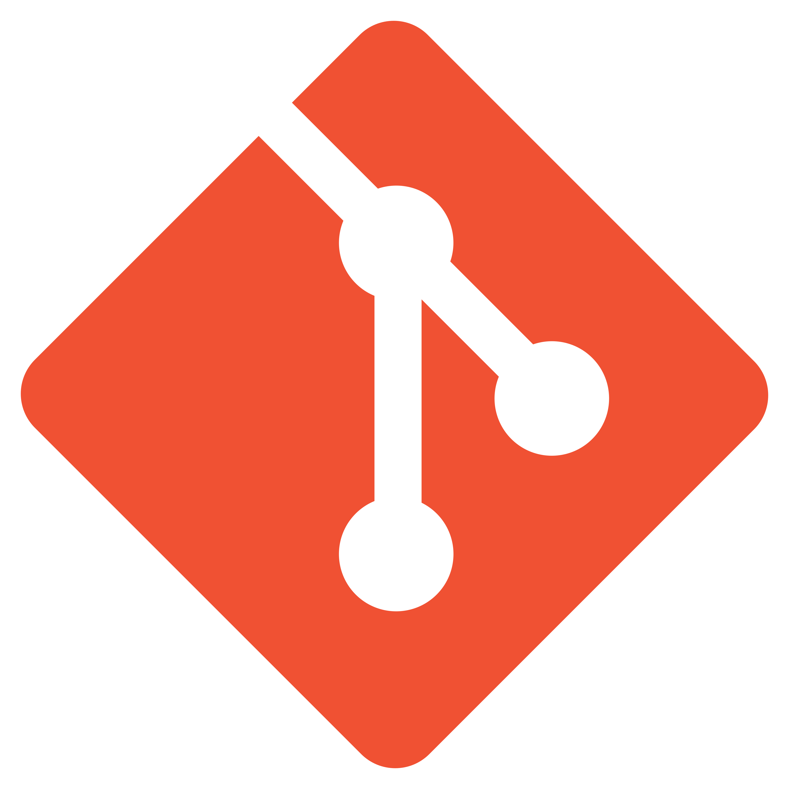

  

---

## Sobre mim

Sou Data Engineer e Software Engineer em Goiânia, com experiência em arquitetura de dados, pipelines e visualização aplicados ao mundo real. Atuo na Brasil Terrenos, empresa de construção civil com mais de 600 colaboradores, onde sou responsável por estruturar e evoluir o ecossistema de dados da companhia.

O que faço no dia a dia:

- Arquitetura Medallion (Bronze → Silver → Gold) com Microsoft Fabric e Delta Lake
- Pipelines de dados com Python e PySpark
- Modelagem e dashboards com Power BI e DAX
- Automações e integrações via SQL Server

Além do trabalho, tenho interesse em inteligência eleitoral, criação de conteúdo e construção de renda passiva, áreas onde dados e estratégia se cruzam.

> Aberto a conversas sobre projetos de dados, colaborações e oportunidades na área.

---

## Tech Stack

<table>
  <tr>
    <td align="center"></td>
    <td>Python</td>
    <td align="center"></td>
    <td>PySpark</td>
  </tr>
  <tr>
    <td align="center"></td>
    <td>SQL Server</td>
    <td align="center"></td>
    <td>Power BI</td>
  </tr>
  <tr>
    <td align="center"></td>
    <td>Microsoft Fabric</td>
    <td align="center"></td>
    <td>Delta Lake</td>
  </tr>
  <tr>
    <td align="center"></td>
    <td>JavaScript</td>
    <td align="center"></td>
    <td>HTML</td>
  </tr>
  <tr>
    <td align="center"></td>
    <td>CSS</td>
    <td align="center"></td>
    <td>Git</td>
  </tr>
</table>

---

## Contato

<table>
  <tr>
    <td></td>
    <td><a href="https://linkedin.com/in/vinisoarescastro"><strong>LinkedIn</strong></a></td>
    <td><a href="https://linkedin.com/in/vinisoarescastro">linkedin.com/in/vinisoarescastro</a></td>
  </tr>
  <tr>
    <td></td>
    <td><a href="mailto:vinisoarescastro@gmail.com"><strong>Gmail</strong></a></td>
    <td><a href="mailto:vinisoarescastro@gmail.com">vinisoarescastro@gmail.com</a></td>
  </tr>
  <tr>
    <td></td>
    <td><a href="https://wa.me/5562997005796"><strong>WhatsApp</strong></a></td>
    <td><a href="https://wa.me/5562997005796">+55 62 99700-5796</a></td>
  </tr>
</table>

---

  

